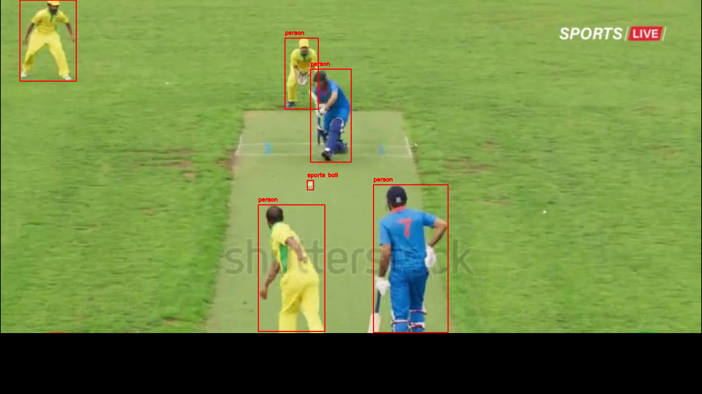

YOLO Ball Tracking for Cricket

Overview:
    This project uses YOLO (You Only Look Once) and OpenCV to track a cricket ball's trajectory in a video. The script processes each frame, detects the ball, and overlays bounding boxes with real-time calculations. Finally, it generates an annotated output video with tracking visualizations. 

Features:
1)  Detects and tracks a cricket ball using YOLOv8v
2)  Processes video frames and saves annotated outputs
3)  Generates a final processed video with visualized tracking
4) Handles file management efficiently

Tech Stack
Python
OpenCV (for video processing)
YOLOv8 (for object detection)
NumPy, Torch (for ML computations)

How to Run

1) Clone the repository

      git clone https://github.com/yourusername/yolo-ball-tracking.git
      cd yolo-ball-tracking

2) Install Dependenices

      pip install opencv-python numpy torch ultralytics
   
4) Place your video (WhiteBall.mp4) in the project folder.

5) Run the Script

     python track_ball.py

6) The processed video will be saved as output_video.mp4.

UnProcessed Frame Example:

Processed Frame Example:  
  

